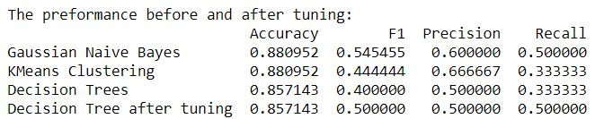
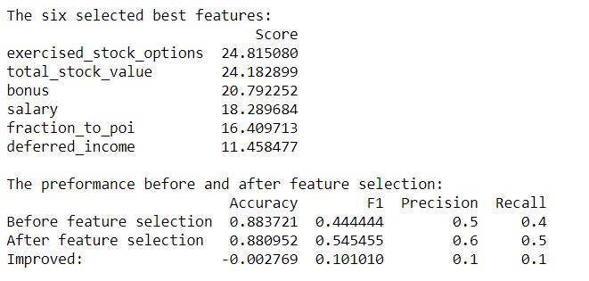

## Identify Fraud from Enron Email
Language: Python (sklearn, pandas, Matplotlib)  
Skills: Machine learning, Feature Scaling, Feature Selection, Validation  
Built machine learning algorithms to identify Enron Employees who may have committed fraud based on the public Enron financial and email dataset. 

  

 

  

